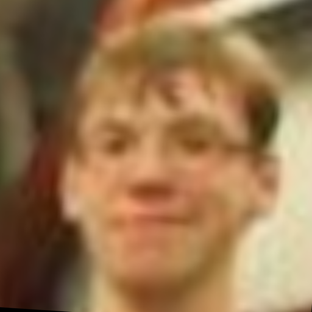
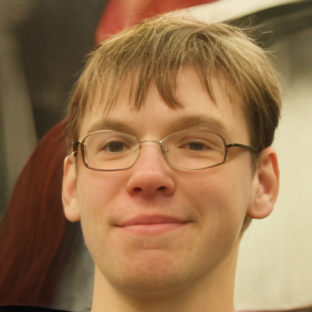
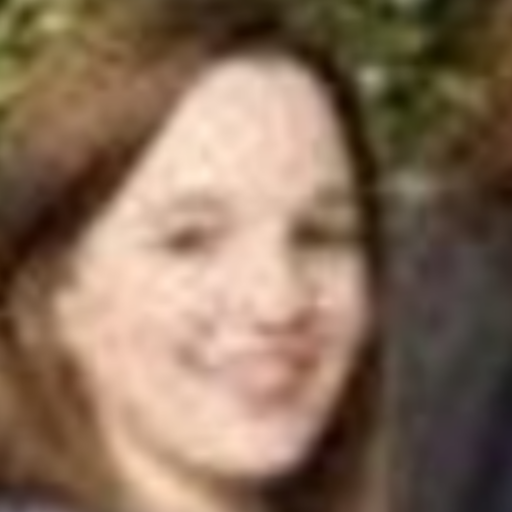
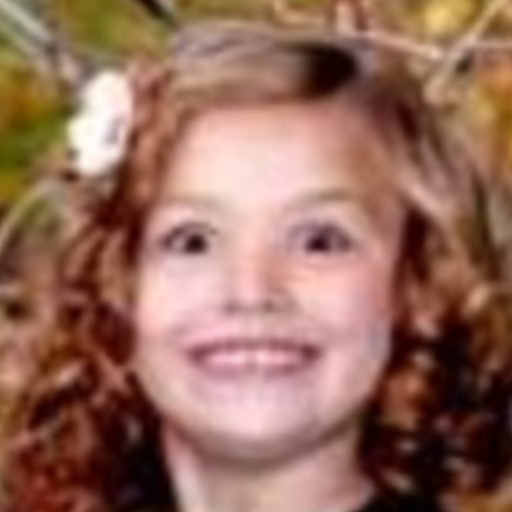
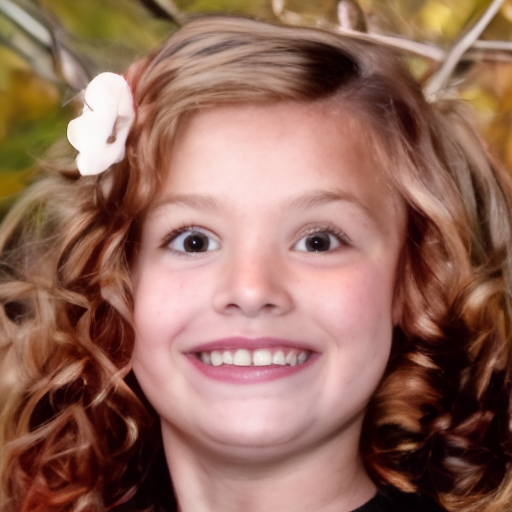

# Identity-Anchored Face-Guided Distillation for Real-Time Blind Face Restoration


## Requirements
* Python 3.10, Pytorch 2.1.2, [xformers](https://github.com/facebookresearch/xformers) 0.0.23
* More detail (See [environment.yml](environment.yml))
A suitable [conda](https://conda.io/) environment named `iafgd` can be created and activated with:

```
conda create -n iafgd python=3.10
conda activate iafgd
pip install -r requirements.txt
```
or
```
conda env create -f environment.yml
conda activate iafgd
```

### :point_right: Blind Face Restoration
  
  

## Testing
```
python inference.py -i [image folder/image path] -o [result folder] --task faceir --scale 1
```

### Training
#### Preparing stage
1. Download the pre-trained VQGAN model from this [link](https://github.com/zsyOAOA/ResShift/releases) and put it in the folder of 'weights'
2. Adjust the data path in the [config](configs) file. 
3. Adjust batchsize according your GPUS. 
    + configs.train.batch: [training batchsize, validation batchsize] 
    + configs.train.microbatch: total batchsize = microbatch * #GPUS * num_grad_accumulation

#### Blind face restoration
```
CUDA_VISIBLE_DEVICES=0,1,2,3,4,5,6,7 torchrun --standalone --nproc_per_node=8 --nnodes=1 main.py --cfg_path configs/faceir_gfpgan512_lpips.yaml --save_dir [Logging Folder] 
```

+ Synthetic data for blind face restoration: [Link](https://drive.google.com/file/d/15Ij-UaI8BQ7fBDF0i4M1wDOk-bnn_C4X/view?usp=drive_link) 

#### Blind Face Restoration
```
python inference.py -i [image folder/image path] -o [result folder] --task faceir --scale 1 --chop_size 256 --chop_stride 256 --bs 16
```

<!--## Note on General Restoration Task-->
<!--For general restoration task, please adjust the settings in the config file:-->
<!--```-->
<!--model.params.lq_size: resolution of the low-quality image.   # should be divided by 64-->
<!--diffusion.params.sf: scale factor for super-resolution,  1 for restoration task.-->
<!--degradation.sf: scale factor for super-resolution, 1 for restoration task.   # only required for the pipeline of Real-Esrgan     -->
<!--```-->
<!--In some cases, you need to rewrite the data loading process. -->

## Acknowledgement

This project is based on [Improved Diffusion Model](https://github.com/openai/improved-diffusion), [LDM](https://github.com/CompVis/latent-diffusion), [SinSR](https://github.com/wyf0912/SinSR), [ResShift](https://github.com/zsyOAOA/ResShift) and [BasicSR](https://github.com/XPixelGroup/BasicSR). We also adopt [Real-ESRGAN](https://github.com/xinntao/Real-ESRGAN) to synthesize the training data for real-world super-resolution. Thanks for their awesome works.
